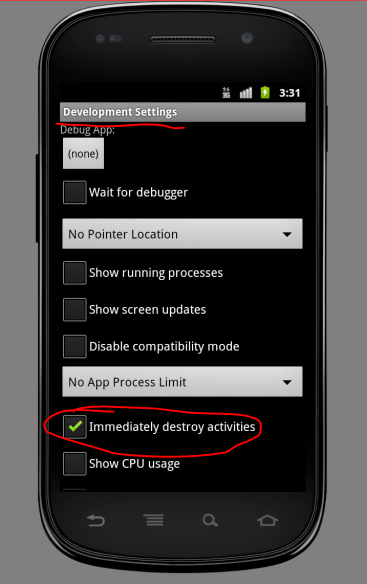
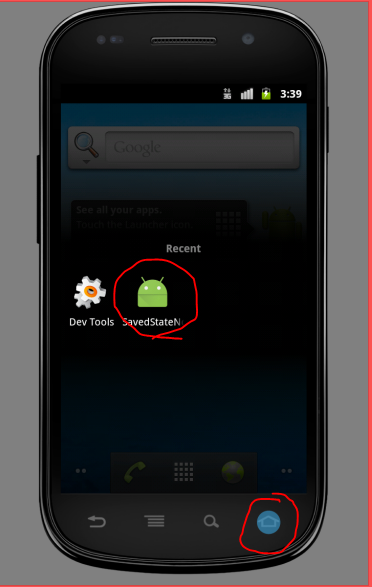

# android-issue196430
Sample test app for https://code.google.com/p/android/issues/detail?id=196430

Steps to reproduce:

1. Launch an `API 10` Android emulator
2. Launch `Test App`
3. Launch `Developers Settings`, and check `Immediatly destoy activities` **Important**
4. Go to history menu and re-open the `Test App`
5. `Test App` will crash

###Screenshots:



###Logcat:
```
E/AndroidRuntime: FATAL EXCEPTION: main
                  java.lang.RuntimeException: Unable to start activity ComponentInfo{com.android.issues.test.savedstatenoclassdeffoundtest/com.android.issues.test.savedstatenoclassdeffoundtest.TestActivity}: android.os.BadParcelableException: ClassNotFoundException when unmarshalling: android.support.v7.widget.RecyclerView$SavedState
                      at android.app.ActivityThread.performLaunchActivity(ActivityThread.java:1647)
                      at android.app.ActivityThread.handleLaunchActivity(ActivityThread.java:1663)
                      at android.app.ActivityThread.access$1500(ActivityThread.java:117)
                      at android.app.ActivityThread$H.handleMessage(ActivityThread.java:931)
                      at android.os.Handler.dispatchMessage(Handler.java:99)
                      at android.os.Looper.loop(Looper.java:123)
                      at android.app.ActivityThread.main(ActivityThread.java:3683)
                      at java.lang.reflect.Method.invokeNative(Native Method)
                      at java.lang.reflect.Method.invoke(Method.java:507)
                      at com.android.internal.os.ZygoteInit$MethodAndArgsCaller.run(ZygoteInit.java:839)
                      at com.android.internal.os.ZygoteInit.main(ZygoteInit.java:597)
                      at dalvik.system.NativeStart.main(Native Method)
                   Caused by: android.os.BadParcelableException: ClassNotFoundException when unmarshalling: android.support.v7.widget.RecyclerView$SavedState
                      at android.os.Parcel.readParcelable(Parcel.java:1958)
                      at android.os.Parcel.readValue(Parcel.java:1846)
                      at android.os.Parcel.readSparseArrayInternal(Parcel.java:2112)
                      at android.os.Parcel.readSparseArray(Parcel.java:1568)
                      at android.os.Parcel.readValue(Parcel.java:1903)
                      at android.os.Parcel.readMapInternal(Parcel.java:2083)
                      at android.os.Bundle.unparcel(Bundle.java:208)
                      at android.os.Bundle.getSparseParcelableArray(Bundle.java:1167)
                      at android.support.design.internal.NavigationMenuPresenter.onRestoreInstanceState(NavigationMenuPresenter.java:174)
                      at android.support.v7.view.menu.MenuBuilder.dispatchRestoreInstanceState(MenuBuilder.java:349)
                      at android.support.v7.view.menu.MenuBuilder.restorePresenterStates(MenuBuilder.java:361)
                      at android.support.design.widget.NavigationView.onRestoreInstanceState(NavigationView.java:196)
                      at android.view.View.dispatchRestoreInstanceState(View.java:6278)
                      at android.view.ViewGroup.dispatchRestoreInstanceState(ViewGroup.java:1211)
                      at android.view.ViewGroup.dispatchRestoreInstanceState(ViewGroup.java:1215)
                      at android.view.ViewGroup.dispatchRestoreInstanceState(ViewGroup.java:1215)
                      at android.view.ViewGroup.dispatchRestoreInstanceState(ViewGroup.java:1215)
                      at android.view.ViewGroup.dispatchRestoreInstanceState(ViewGroup.java:1215)
                      at android.view.View.restoreHierarchyState(View.java:6257)
                      at com.android.internal.policy.impl.PhoneWindow.restoreHierarchyState(PhoneWindow.java:1486)
                      at android.app.Activity.onRestoreInstanceState(Activity.java:844)
                      at android.app.Activity.performRestoreInstanceState(Activity.java:816)
                      at android.app.Instrumentation.callActivityOnRestoreInstanceState(Instrumentation.java:1096)
                      at android.app.ActivityThread.performLaunchActivity(ActivityThread.java:1625)
                      at android.app.ActivityThread.handleLaunchActivity(ActivityThread.java:1663) 
                      at android.app.ActivityThread.access$1500(ActivityThread.java:117) 
                      at android.app.ActivityThread$H.handleMessage(ActivityThread.java:931) 
                      at android.os.Handler.dispatchMessage(Handler.java:99) 
                      at android.os.Looper.loop(Looper.java:123) 
                      at android.app.ActivityThread.main(ActivityThread.java:3683) 
                      at java.lang.reflect.Method.invokeNative(Native Method) 
                      at java.lang.reflect.Method.invoke(Method.java:507) 
                      at com.android.internal.os.ZygoteInit$MethodAndArgsCaller.run(ZygoteInit.java:839) 
                      at com.android.internal.os.ZygoteInit.main(ZygoteInit.java:597) 
                      at dalvik.system.NativeStart.main(Native Method)
```
